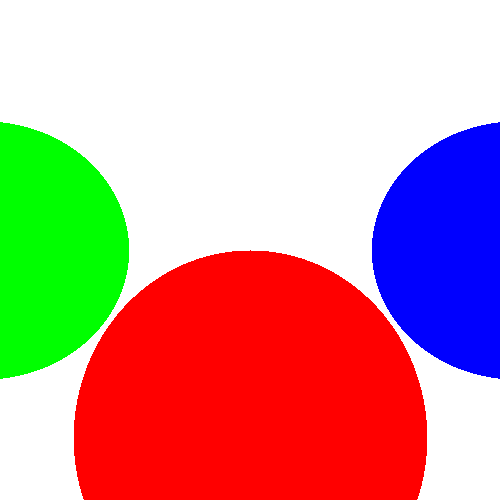

# Basic Ray Tracer with Spheres

A simple ray tracer that represents three spheres with three different colors (Red, Green, Blue). It shoots a ray at each pixel and checks for intersection. If the ray hits a sphere, it colors the pixel with the sphere's color; otherwise, it paints the pixel white (the background color).

## Usage
1. Clone this repository or download it as a ZIP file.
2. Run the main class `RayTracer.java`.
3. The output image will be created in the root folder (i.e., the `Assignment_1` folder) and named `Assignment_1_result.png`.

## Result
