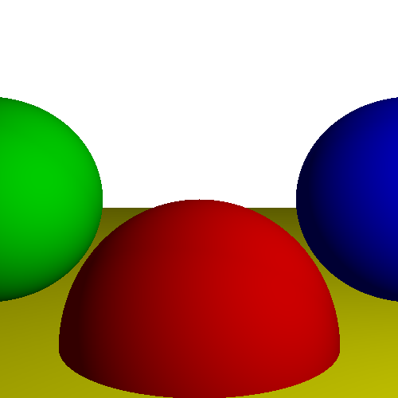
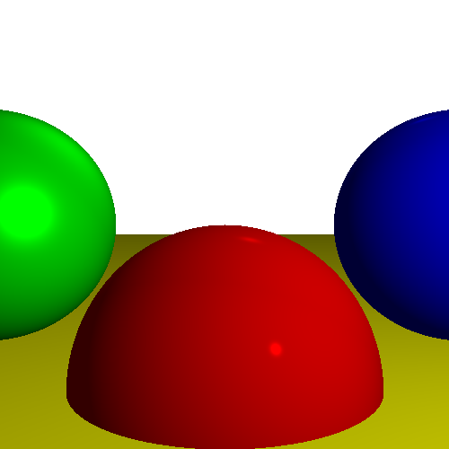

# Ray Tracer with Lighting and Specular Highlights

In this assignment, we added more depth and reality to the scene, moving from a 2D-like rendering to a 3D scene using lighting and object specularity (shininess).

## Features
- **Lighting:** We check if a ray hits an object that is directly exposed to light. If so, the returned color will be more intense. The less exposed the object is to light, the lower the color intensity of that pixel.
- **Specular (Shininess):** If an object's specular value is high, areas highly exposed to lighting will have even higher intensity.

## Results
- `result1.png`: Rendering with lighting but no specular.
- `result_final.png`: Rendering with both lighting and specular.

## Usage
1. Clone this repository or download it as a ZIP file.
2. Run the main class `RayTracer.java`.
3. The output images will be created in the root folder (i.e., the `Assignment_2` folder) and named `Assignment_2_result1.png` and `Assignment_2_result_final.png`.

## Results

- Rendering with lighting and no specular

 

 - Rendering with both lighting and specular
 
