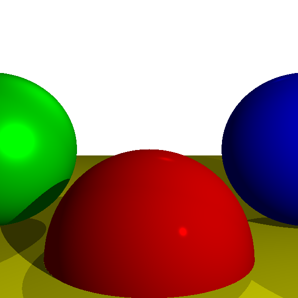
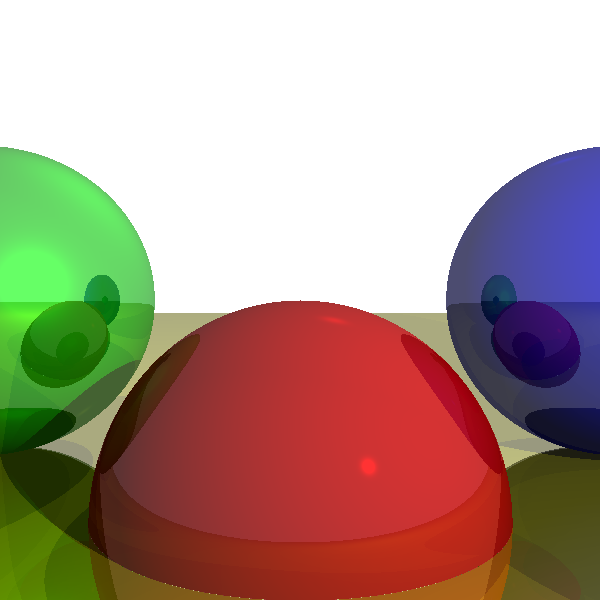
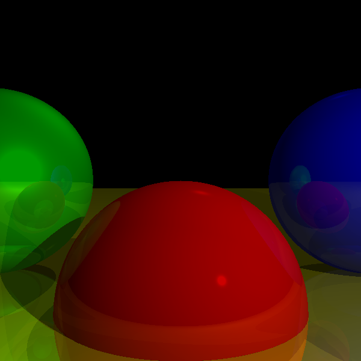

# Ray Tracer with Shadows and Reflectivity

In this assignment, we added shadows and reflectivity to create a more realistic and rich image.

## Features
- **Shadows:** Before computing diffusion or shininess, we check if a pixel is behind an object. If it is, we skip those computations, resulting in darker pixels that imitate shadows.
- **Reflectivity:** This is an object property that mirrors the view reflected on its surface from other objects. We achieve this by shooting a ray perpendicular to the point where the original ray hits, reflecting what the sub-ray intersects with (like a scene within a scene). This ray bounces based on the `recursionDepth`.

## Results
- `result1.png`: Rendering with shadows.
- `result2.png`: Rendering with shadows and reflection (white background).
- `result_final.png`: Final result with a black background.

## Usage
1. Clone this repository or download it as a ZIP file.
2. Run the main class `RayTracer.java`.
3. The output images will be created in the root folder (i.e., the `Assignment_3` folder) and named `Assignment_3_result1.png`, `Assignment_3_result2.png`, and `Assignment_3_result_final.png`.

## Results

- Rendering with shadows

  

- Rendering with shadows and reflection (white background)

  

- Final result with black background

