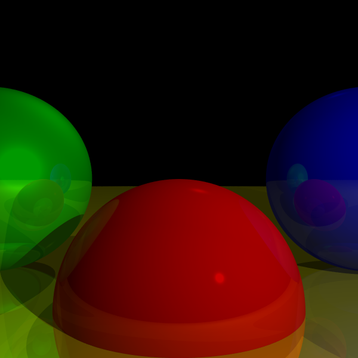
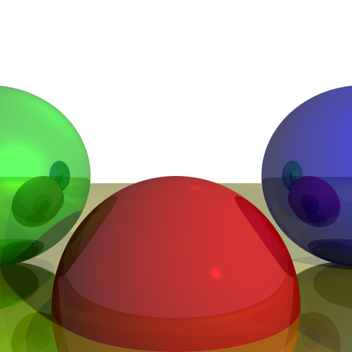

# Ray Tracer with Supersampling Anti-Aliasing

In this assignment, we introduced supersampling, an anti-aliasing method that makes the image more crisp and sharp. However, it degrades performance because instead of shooting one ray per pixel, we shoot multiple rays based on the sampling factor.

## Features
- **Supersampling:** For example, in a 600x600 pixel rendering with a sampling factor of 4 (4x4 rays per pixel, totaling 16 rays per pixel), there will be 5,760,000 rays instead of 360,000.

## Results
- `Assignment_4_result_4by4.png`: Supersampling with a factor of 4 (black background).
- `Assignment_4_result_5by5_woutJittering.png`: Supersampling with a factor of 5 (black background, no jittering).
- `Assignment_4_result_5by5.png`: Supersampling with a factor of 5 (black background).
- `Assignment_4_result_whiteBackground.png`: Supersampling with a factor of 5 (white background).

## Usage
1. Clone this repository or download it as a ZIP file.
2. Run the main class `RayTracer.java`.
3. The output images will be created in the `Assignment_4/Result` folder.

## Results

- Factor 4 supersampling (black background)

  

- Factor 5 supersampling (black background, no jittering)

  

- Factor 5 supersampling (black background)

  

- Factor 5 supersampling (white background)

