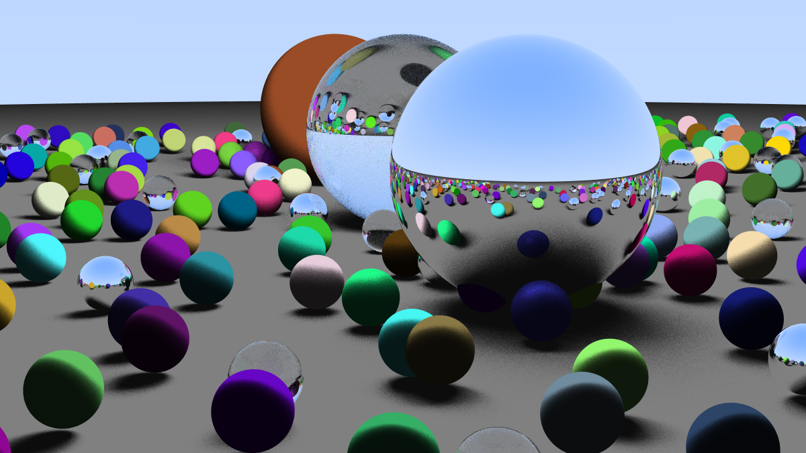
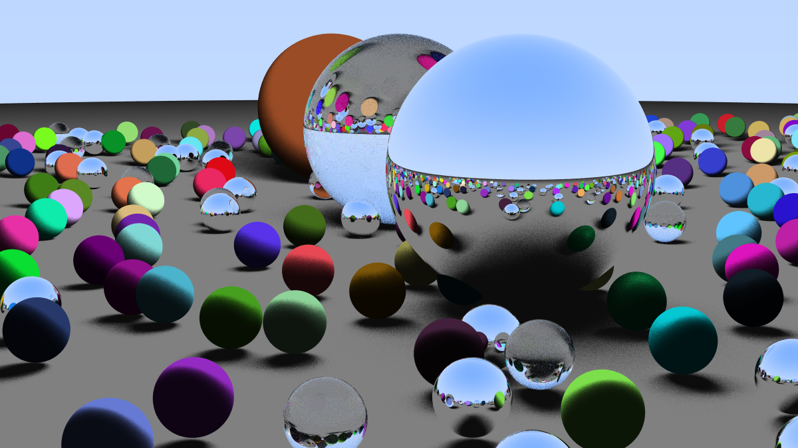

# Advanced Ray Tracer with Camera, Materials, and Area Lighting

In this project, we combine all the concepts introduced in previous assignments and add new features for a more advanced ray tracer.

## New Features
- **Camera Class:** Handles the viewpoint of the scene with more control instead of a static point of view.
- **MaterialType Class:** Allows objects to have different looks and properties (DIFFUSE, METAL, DIELECTRIC).
- **Ray Class:** Replaces the old inline ray implementation for better usability and readability.
- **Area Lighting:** A rectangular light source that covers a larger area (based on its height and width), used as a simple replacement for global illumination.

## Results
- The results are saved in the `Results` folder. `result1` through `result6` represent different development stages, and the final results are labeled as `final1` and `final2`.
- Rendering a full result takes an average of 6.5 minutes.

## Usage
1. Clone this repository or download it as a ZIP file.
2. Run the main class `RayTracer.java`.
3. The output images will be created in the `Project_1/Results` folder and named `Project_1_result_final1.png` and `Project_1_result_final2.png`.

## Results

- Randomized result #1
 

- Randomized result #2
