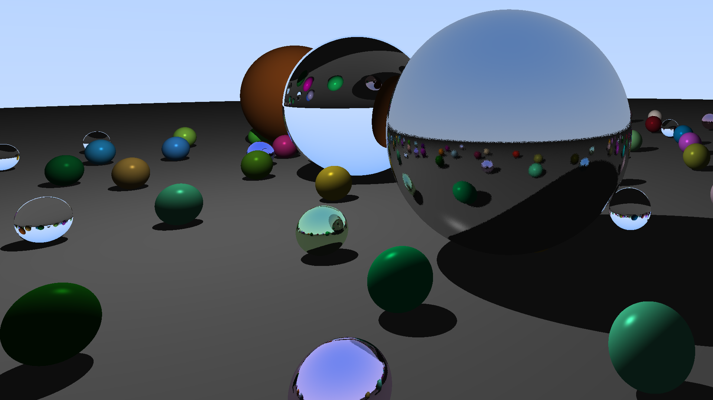
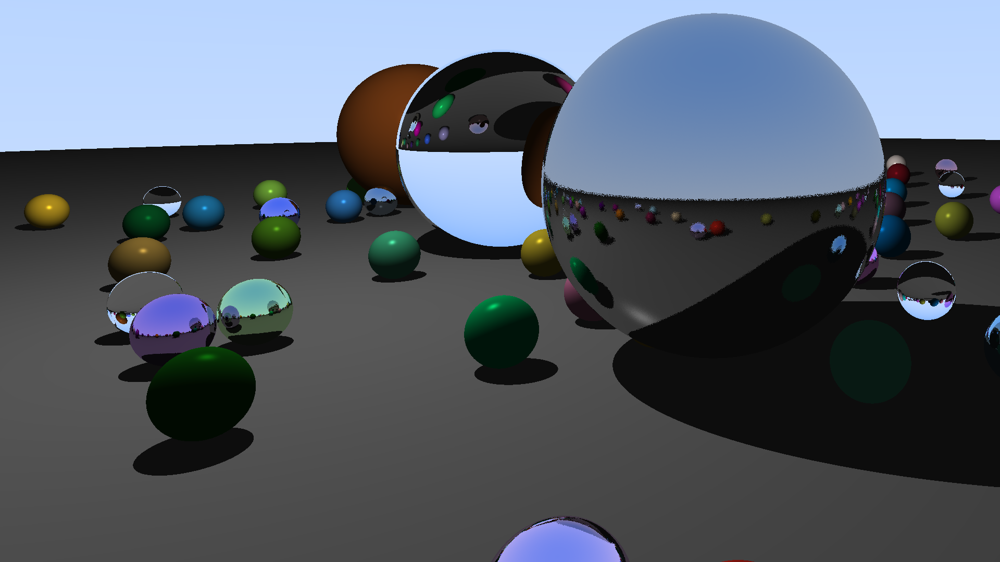
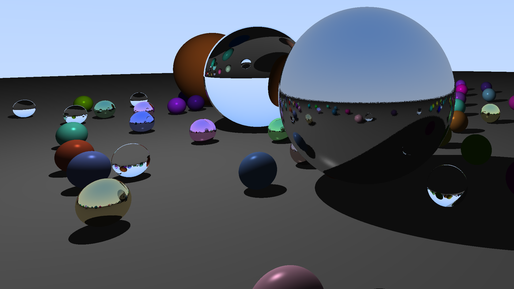
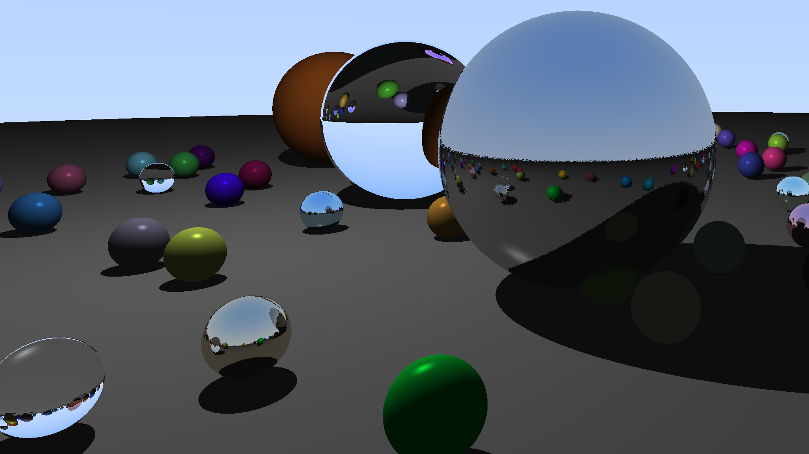

# GLSL Ray Tracing Shader

This is a simple GLSL fragment shader that implements basic ray tracing to render a 3D scene composed of spheres. It demonstrates diffuse lighting, metal reflections with a touch of fuzz, and glass-like refractions.

## Overview

- **Scene Setup:** A ground sphere, three main spheres, and many small randomized spheres.
- **Materials:** Supports diffuse, metal, and dielectric (glass) materials.
- **Lighting:** A single point light provides ambient, diffuse, and specular illumination.
- **Camera:** Configurable camera setup for generating rays per pixel.

## Customization
5. RAND_SEED | change to randomize small spheres materials and positions.
27. MAX_SPHERES | the number of spheres in the scene.
160. l.intensitiy | determine the brightness of the scene -kind of-
307. fuzz | to add fuzziness to metal spheres -above 0.1 might look a bit distorted-

## Usage

- **Run the Shader:** Paste the code into a GLSL-compatible environment (e.g., ShaderToy or a WebGL setup). Or just paste this direct link to the project on shadertoy https://www.shadertoy.com/view/wcfSW7

- **Uniforms:** Ensure you provide the necessary uniforms like `iResolution` for proper rendering.

## Results and Observations

- The attached results are for the different RAND_SEED that I've used, feel free to explore that.
- For a 100 spheres, the average compilation time was around 55 seconds.
- For a 80 spheres, the average compilation time was around 28 seconds.
- For a 64 spheres, the average compilation time was around 14 seconds.
- For a 50 spheres, the average compilation time was around 7 seconds.
- To render only the main spheres -ground, the big three- it takes around 0.3 seconds.   

- Randomized result #1

- Randomized result #2

 

- Randomized result #3

 

- Randomized result #4

